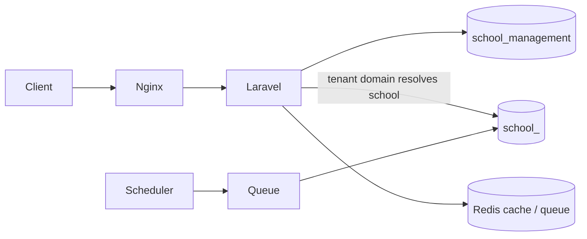
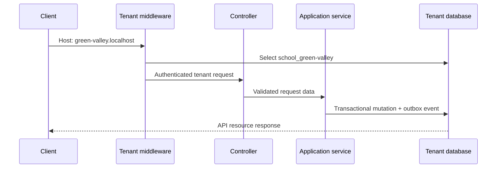

# Architecture

## Overview

This is a Laravel modular monolith using clean/hexagonal-style boundaries and **database-per-tenant** SaaS isolation. It is deliberately one deployable application, not microservices: modules communicate through application services and transactional outbox events.



## Multi-tenancy

`stancl/tenancy` v3.9 provides tenancy. A school is identified by its request domain, for example `green-valley.localhost`.

| Layer | Database | Contains |
| --- | --- | --- |
| Central | `school_management` | `tenants`, `domains`, platform users and platform authorization |
| Tenant | `school_<tenant-id>` | school users, roles, SIS data, attendance, homework, wallet, notifications, audit/outbox data |

The `InitializeTenancyByDomain` middleware runs before tenant API handling. Stancl then switches the active database connection to that school’s database. Cache, filesystem, queue payloads, and Redis keys are also tenant-scoped by the configured bootstrappers.

There is no `X-Tenant-ID` request header. A header can be forged and does not form a trustworthy routing boundary; domain-based identification is the public tenant boundary.

## Request path



## Module layout

Each business context is under `app/Modules/<Context>`.

```text
app/Modules/<Context>/
├── Application/       # use cases, policies, transactions
├── Domain/Models/     # Eloquent domain models
├── Infrastructure/    # framework/gateway/queue adapters
└── Interfaces/Http/   # controllers, Form Requests, API Resources
```

Controllers remain thin: they receive a Form Request, authorize through middleware/application services, then return a JsonResource. Business mutations are in application services so they are testable without HTTP.

### Main modules

| Module | Responsibility |
| --- | --- |
| `Tenancy` | school provisioning and Stancl tenant model |
| `IdentityAccess` | platform/tenant authentication, roles, permissions, audit logs |
| `SIS` | students, parents, classes, academic years |
| `Staff` | teachers, subjects, teacher/class/subject assignments |
| `Attendance` | recording, corrections, justifications, alerts |
| `Homework` | assignments, submissions, attachments, rubrics, grading |
| `Wallet` | accounts, immutable ledger, top-ups, refunds, reconciliation |
| `Notifications` | preferences, in-app notifications, transactional outbox worker |
| `Reporting` | attendance, homework, wallet reports and exports |

## Authorization

Authentication uses Laravel Sanctum. Tenant permissions use Spatie Laravel Permission in each tenant database.

Roles: `school-admin`, `teacher`, `parent`, and `student`.

Middleware permissions protect routes (`can:sis.manage`, `can:attendance.record`, `can:homework.grade`, and so on). Application services add record-level checks such as:

- a parent may access only linked children;
- a student may access only their own records/submissions;
- a teacher may act only for assigned class/subject combinations;
- a school administrator can use designated management flows.

## Data integrity patterns

### Wallet ledger

Wallet transactions are append-only. `ApplyWalletTransaction` locks the wallet account row, checks balance, records a unique idempotency key, updates the cached balance, and writes an outbox event in one database transaction. Refunds create a compensating debit rather than editing a historical credit.

### State transitions

Important workflows use explicit status values:

- homework: `assigned`, `archived`;
- submission: `submitted`, `late`, `graded`;
- attendance justification: `pending`, `approved`, `rejected`;
- payment intent: `pending`, `succeeded`, `cancelled`, `failed`, `refunded`.

Application services reject invalid transitions, such as confirming a failed payment, modifying archived homework, or changing a rubric after grading begins.

### Transactional outbox

Domain changes write an `outbox_messages` record in the **same tenant transaction**. The scheduled `outbox:dispatch` command queues per-tenant processing. This protects against losing a notification because a database write succeeded but a later queue call failed.

Events currently drive wallet and attendance in-app notifications. The `wallet:reconcile-topups` scheduler runs every ten minutes per tenant to settle old pending intents safely.

## API design

- Versioned routes: `/api/v1`.
- Central routes: `routes/api.php`.
- Tenant routes: `routes/tenant.php`.
- Validation: dedicated Laravel Form Requests for write endpoints.
- Responses: Laravel JsonResources with consistent `data` envelopes.
- Pagination: list endpoints return Laravel pagination metadata.
- Authentication: `Authorization: Bearer <Sanctum token>`.

The OpenAPI contract is at `docs/openapi.yaml`, and the Postman assets are under `postman/`.

## Runtime architecture

Docker Compose runs Nginx, PHP-FPM/Laravel, MySQL 8.4, Redis, a queue worker, scheduler worker, and Mailpit. Nginx is the only public application port by default. MySQL is exposed on `3307` only for development tools.
